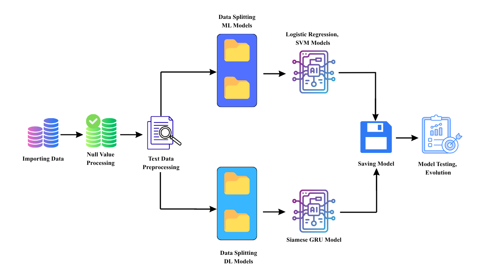

## SparkTech AI Pipeline

- **Overview**: This repository contains a modeling pipeline for a question-pair duplicate detection task. The main workflow is implemented in `model_pipeline.ipynb` which performs data cleaning, text preprocessing, feature extraction, model training (classical ML and deep learning), evaluation, and saves trained models into the `models/` folder.

- **Flow Diagram**: This flow diagram will help you to visualize the exact senario of the whole development process.



- **Notebook**: The primary notebook is `model_pipeline.ipynb`. It:
	- Loads and cleans `dataset/train.csv`.
	- Preprocesses text (HTML removal, decontraction, stopwords removal, stemming/lemmatization).
	- Vectorizes text with TF-IDF for classical models.
	- Trains and evaluates Logistic Regression and Linear SVM models and saves them under `models/`.
	- Builds and trains an LSTM classifier and a Siamese GRU network; trained Keras models are saved under `models/`.

- **Repository Structure**:
	- `model_pipeline.ipynb` : Jupyter notebook with the full pipeline.
	- `dataset/train.csv` : Input dataset used by the notebook.
	- `models/` : Saved model artifacts (examples: `lstm_model.keras`, `siamese_gru_model.keras`, `logistic_regression_model.pkl`, `tfidf_vectorizer.pkl`).

- **Key model files produced by the notebook**:
	- `models/logistic_regression_model.pkl` (scikit-learn)
	- `models/tfidf_vectorizer.pkl` (TF-IDF vectorizer)
	- `models/svm_linear_model.pkl` (Linear SVM)
	- `models/lstm_model.keras` (Keras LSTM model)
	- `models/siamese_gru_model.keras` (Keras Siamese GRU model)

- **Important Notebook Settings**:
	- The notebook sets `root_dir = "F:/"` and `project_folder = "sparktech/"`. If you run the notebook elsewhere, update those variables or run the notebook from `F:/sparktech` so paths resolve correctly.

- **Dependencies (suggested)**:
	- Python 3.8+ (tested with 3.8–3.11)
	- pandas
	- numpy
	- matplotlib
	- seaborn
	- scikit-learn
	- tensorflow (2.x)
	- nltk
	- beautifulsoup4
	- wordcloud
	- joblib
	- tqdm

- **Quick setup (PowerShell)**:

```powershell
# create and activate a venv (PowerShell)
python -m venv .venv; .\.venv\Scripts\Activate.ps1

# upgrade pip and install dependencies
python -m pip install --upgrade pip
pip install pandas numpy matplotlib seaborn scikit-learn tensorflow nltk beautifulsoup4 wordcloud joblib tqdm
```

- **Running the notebook**:
	1. Open `model_pipeline.ipynb` in Jupyter Notebook / JupyterLab / VS Code.
	2. Confirm or edit the `root_dir` and `project_folder` variables near the top of the notebook so they match your environment.
	3. Run the notebook cells in order. Note: training the deep models (LSTM / Siamese GRU) can be time-consuming and requires sufficient RAM/GPU.

- **Notes & recommendations**:
	- The notebook performs heavy preprocessing and model training; if you only want to experiment with inference, use the saved models in `models/` and the saved `tfidf_vectorizer.pkl`.
	- The preprocessing uses NLTK resources (`wordnet`, `omw-1.4`); download them (the notebook already calls `nltk.download(...)`) or run `python -c "import nltk; nltk.download('wordnet'); nltk.download('omw-1.4')"` once in your environment.
 	- If you plan to retrain the TensorFlow models, consider running on a machine with GPU support and ensuring `tensorflow` matches your CUDA/cuDNN setup.

- **Contact / Author**: Repository owner: `AhmadSaheb007`.
 
## Model Performance Overview

**Summary & Comparison Table**: This section summarizes evaluation metrics for the main models trained by the notebook `model_pipeline.ipynb` and provide a proper comparison to understands the performances more efficiently. Here the compared models are:
- Logistic Regression (TF-IDF) Model.
- Linear SVM (TF-IDF) Model.
- LSTM (Keras) Model 5 Epochs.
- LSTM (Keras) Model 10 Epochs.
- Siamese GRU (Keras).

| Model | Accuracy | Precision | Recall | F1-score | ROC-AUC |  Notes |
|---|---:|---:|---:|---:|---:|---|
| Logistic Regression (TF-IDF) | 75% | 77% | 82% | 62% | 81% | Fast baseline; interpretable coefficients |
| Linear SVM (TF-IDF) | 76% | 75% | 76% | 75% | 82% | Strong baseline for high-dimensional sparse features |
| LSTM (Keras) 5 epoch | 77% | 77% | 77% | 77% | 82% | Captures sequence information; may require regularization |
| LSTM (Keras) 10 epoch | 77% | 77% | 77% | 77% | 82% | Captures sequence information; may require regularization |
| Siamese GRU (Keras) | 83% | 75% | 81% | 78% | 89% | Encodes pairwise interactions; often best for semantic matching |


**Conclusion (recommendation)**: While exact results depend on hyperparameters and dataset splits, But in current senario and evalution matrices, the **Siamese GRU** architecture is performing as the strongest candidate for duplicate-question detection because it explicitly models pairwise semantic interactions between questions, which typically improves recall and F1 for semantic-paraphrase tasks. If you prioritize inference speed and simplicity, the `Logistic Regression` model with TF-IDF is a solid, lightweight alternative.

